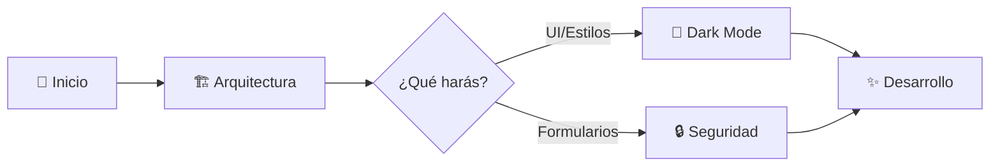

<div align="center">


# 📚 Documentación del Proyecto
## JavierTamaritWeb

[](README.md)
[](../../../)
[](dark-mode.md)
[](formularios-seguridad.md)

**Centro de conocimiento técnico del proyecto**

[🎨 Dark Mode](dark-mode.md)  •  [🔒 Seguridad](formularios-seguridad.md)  •  [🏗️ Arquitectura](arquitectura.md)

</div>

---

## 📖 Guías Disponibles

<div align="center">

| Documento | Descripción | Nivel | Estado |
|:---------:|:------------|:-----:|:------:|
| **[🎨 Dark Mode](dark-mode.md)** | Modo oscuro completo con toggle | Intermedio | ✅ Completo |
| **[🔒 Seguridad](formularios-seguridad.md)** | Protección de formularios (7 capas) | Avanzado | ✅ Completo |
| **[🏗️ Arquitectura](arquitectura.md)** | Estructura del proyecto (33 SCSS, 12 JS) | Básico-Intermedio | ✅ Completo |
| **[🍳 Sistema de Recetas](recetas-sistema.md)** | Buscador inteligente con filtros avanzados | Intermedio-Avanzado | ✅ Completo |

</div>

---

## 🎯 Flujo de Lectura

<div align="center">



</div>

### 1. Para Desarrolladores Nuevos

**Ruta recomendada:**
1. Lee [Arquitectura del Proyecto](arquitectura.md) - Entiende la estructura
2. Explora [Dark Mode](dark-mode.md) si trabajas en UI
3. Consulta [Seguridad](formularios-seguridad.md) si trabajas con formularios

### 2. Para Mantenimiento

**Consulta rápida:**
- **Cambiar colores** → [Variables SCSS](arquitectura.md#sistema-de-variables)
- **Añadir dark mode** → [Guía Dark Mode](dark-mode.md#cómo-añadir-nuevos-componentes)
- **Crear formulario** → [Seguridad](formularios-seguridad.md#añadir-nuevos-formularios)

---

## 🚀 Quick Start

<div align="center">

```bash
# 1. Instalar dependencias
npm install

# 2. Iniciar desarrollo (watch mode)
npx gulp

# 3. Ver en navegador
open build/index.html
```

</div>

---

## 📋 Guías Rápidas

### Añadir Dark Mode a un Componente

```scss
// src/scss/base/_dark-mode.scss
[data-theme="dark"] .mi-componente {
    background: v.$gris-900;
    color: v.$blanco;
    border-color: v.$primario;
    
    &__titulo {
        color: v.$blanco;
    }
    
    &__boton:hover {
        background: v.$negro;
        color: v.$primario;
    }
}
```

✅ Compila: `npx gulp css`

### Crear un Formulario Seguro

```javascript
// src/js/mi-formulario-seguro.js
class MiFormularioSeguro {
    sanitizarTexto(texto) {
        return texto.replace(/<[^>]*>/g, '');
    }
    
    manejarInput(event) {
        event.target.value = this.sanitizarTexto(event.target.value);
    }
}
```

✅ Incluye: `<script src="js/mi-formulario-seguro.js" defer></script>`

---

## 🔍 Búsqueda Rápida

<div align="center">

| Necesito... | Ir a... |
|:------------|:--------|
| Cambiar un color | [Variables SCSS](arquitectura.md#sistema-de-variables) |
| Añadir dark mode | [Guía Dark Mode](dark-mode.md#cómo-añadir-nuevos-componentes) |
| Crear formulario seguro | [Seguridad](formularios-seguridad.md#añadir-nuevos-formularios) |
| Ver estructura | [Arquitectura](arquitectura.md#estructura-de-directorios) |
| Entender Gulp | [Build System](arquitectura.md#sistema-de-build) |
| Convenciones | [Código](arquitectura.md#convenciones-de-código) |

</div>

---

## ✨ Características Documentadas

<div align="center">

| Feature | Documentación | Complejidad |
|:-------:|:--------------|:-----------:|
| 🎨 **Modo Oscuro** | Toggle con persistencia, 1000+ líneas SCSS | ⭐⭐⭐ |
| 🔒 **Seguridad** | 7 capas de protección XSS/SQL | ⭐⭐⭐⭐ |
| 🏗️ **Arquitectura** | BEM + SCSS Modules + ES6 | ⭐⭐ |
| 📝 **33 Archivos SCSS** | Organizados por componentes | ⭐⭐ |
| ⚡ **12 Módulos JS** | Clases y patrones modernos | ⭐⭐⭐ |

</div>

---

## 🎯 Checklists

### ✅ Antes de Hacer Commit

- [ ] SCSS compiló sin errores (`npx gulp css`)
- [ ] Dark mode funciona correctamente
- [ ] Formularios son seguros
- [ ] Código sigue convenciones
- [ ] Funciona en mobile y desktop
- [ ] No hay errores en consola

### ✅ Antes de Deploy

- [ ] Todos los archivos en `build   /`
- [ ] Imágenes optimizadas
- [ ] SEO correcto (meta tags)
- [ ] Enlaces absolutos correctos
- [ ] Probado en Chrome/Firefox/Safari
- [ ] Responsive verificado

---

## 📊 Estado del Proyecto

<div align="center">

### Versión Actual: 3.0.2

| Métrica | Valor |
|:--------|:------|
| **Páginas HTML** | 10 |
| **Archivos SCSS** | 33 organizados |
| **Módulos JavaScript** | 12 modulares |
| **Seguridad** | A+ (OWASP) |
| **Dark Mode** | ✓ Completo |
| **Responsive** | ✓ Mobile-first |
| **Accesibilidad** | ARIA compliant |

</div>

---

## 🆘 Problemas Comunes

### 🔴 Los estilos dark mode no se aplican

**Soluciones:**
1. Compila SCSS: `npx gulp css`
2. Hard refresh: `Cmd+Shift+R` (Mac) / `Ctrl+Shift+R` (Windows)
3. Verifica `_dark-mode.scss` esté en `_index.scss`

Ver: [Resolución Dark Mode](dark-mode.md#resolución-de-problemas)

### 🔴 El formulario no valida

**Soluciones:**
1. Verifica que `buscador-seguro.js` esté cargado
2. Revisa la consola del navegador
3. Confirma event listeners activos

Ver: [Testing Formularios](formularios-seguridad.md#testing-y-validación)

### 🔴 Gulp no compila

**Soluciones:**
1. Reinstala dependencias: `npm install`
2. Verifica versión de Node.js
3. Revisa errores en `gulpfile.js`

---

## 🔗 Enlaces Útiles

### Recursos Externos

<div align="center">

| Recurso | Descripción |
|:--------|:------------|
| [Sass Docs](https://sass-lang.com/documentation) | Documentación oficial de Sass |
| [Gulp Docs](https://gulpjs.com/docs/en/getting-started/quick-start) | Guía de Gulp |
| [BEM](http://getbem.com/) | Metodología BEM |
| [OWASP Top 10](https://owasp.org/www-project-top-ten/) | Seguridad web |

</div>

### Recursos Internos

- 📄 [README Principal](../../README.md)
- 📁 [Código Fuente](../../src/)
- 🚀 [Build](../../build/)

---

## 📝 Contribuir

Si mejoras la documentación:

1. ✅ Mantén el formato markdown consistente
2. ✅ Usa emojis para secciones
3. ✅ Incluye ejemplos de código
4. ✅ Actualiza este README si añades archivos
5. ✅ Actualiza fecha al final

---

<div align="center">

**© 2025 Javier Tamarit**  
*Documentación Técnica Completa*

**Última actualización:** 2025-12-12  
**Versión de documentación:** 1.0.0

[🎨 Dark Mode](dark-mode.md)  •  [🔒 Seguridad](formularios-seguridad.md)  •  [🏗️ Arquitectura](arquitectura.md)

</div>
