# Modo Oscuro - Documentación Completa

## Tabla de Contenidos

1. [Introducción](#introducción)
2. [Arquitectura General](#arquitectura-general)
3. [Implementación SCSS](#implementación-scss)
4. [Implementación JavaScript](#implementación-javascript)
5. [Paleta de Colores](#paleta-de-colores)
6. [Guía de Uso](#guía-de-uso)
7. [Cómo Añadir Nuevos Componentes](#cómo-añadir-nuevos-componentes)
8. [Resolución de Problemas](#resolución-de-problemas)

---

## Introducción

El modo oscuro de JavierTamaritWeb es una implementación completa basada en el atributo `data-theme="dark"` en el elemento `<html>`. Esta documentación explica en detalle cómo funciona y cómo extenderla.

### Características Principales

- ✅ **Activación dinámica** mediante JavaScript
- ✅ **Persistencia** en localStorage
- ✅ **Respeto** a `prefers-color-scheme`
- ✅ **Transiciones suaves** entre modos
- ✅ **Sincronización** entre pestañas
- ✅ **Botón toggle glassmorphism** accesible

---

## Arquitectura General

### Flujo de Funcionamiento

```mermaid
graph TD
    A[Usuario carga página] --> B{Hay preferencia guardada?}
    B -->|Sí| C[Cargar preferencia de localStorage]
    B -->|No| D{Sistema prefiere dark?}
    D -->|Sí| E[Aplicar dark mode]
    D -->|No| F[Aplicar light mode]
    C --> G[Aplicar tema correspondiente]
    E --> G
    F --> G
    G --> H[Usuario puede toggle manualmente]
    H --> I[Guardar en localStorage]
    I --> J[Sincronizar otras pestañas]
```



### Archivos Clave

| Archivo | Ubicación | Función |
|---------|-----------|---------|
| `_dark-mode.scss` | `src/scss/base/` | Todos los estilos dark mode |
| `theme-toggle.js` | `src/js/` | Lógica del toggle y persistencia |
| `_variables.scss` | `src/scss/base/` | Variables de color |

---

## Implementación SCSS

### Estructura del Archivo `_dark-mode.scss`

El archivo tiene **~1000+ líneas** organizadas en secciones:

#### 1. Transiciones Globales

```scss
[data-theme="dark"] *,
[data-theme="dark"] *::before,
[data-theme="dark"] *::after {
    transition: background-color 0.3s ease, 
                border-color 0.3s ease, 
                color 0.3s ease,
                box-shadow 0.3s ease;
}
```

**Por qué:** Crear transiciones suaves al cambiar de modo.

**Importante:** Respeta `prefers-reduced-motion`:

```scss
@media (prefers-reduced-motion: reduce) {
    [data-theme="dark"] *,
    [data-theme="dark"] *::before,
    [data-theme="dark"] *::after {
        transition: none;
    }
}
```

#### 2. Base HTML/Body

```scss
html[data-theme="dark"] {
    background: v.$negro;
}

[data-theme="dark"] body {
    background: v.$negro;
    color: v.$blanco;
}
```

#### 3. Componentes por Sección

Cada sección está claramente delimitada:

```scss
// ============================================
// HEADER
// ============================================
[data-theme="dark"] .header {
    background: v.$negro;
    // ...
}

// ============================================
// NAVEGACIÓN
// ============================================
[data-theme="dark"] .navegacion {
    // ...
}
```

### Convenciones de Nomenclatura

**Selector Base:**
```scss
[data-theme="dark"] .componente {
    // Estilos del componente raíz
}
```

**Elementos Anidados:**
```scss
[data-theme="dark"] .componente {
    &__elemento {
        color: v.$blanco;
    }
    
    &__otro-elemento {
        background: v.$gris-900;
    }
}
```

### Uso de Variables

**IMPORTANTE:** Siempre usa variables SCSS, NUNCA colores hardcodeados:

✅ **CORRECTO:**
```scss
background: v.$gris-900;
color: v.$primario;
```

❌ **INCORRECTO:**
```scss
background: #1a1a1a;
color: #4ECDC4;
```

### Uso de `background` vs `background-color`

**IMPORTANTE:** En este proyecto se usa `background`, NO `background-color`:

✅ **CORRECTO:**
```scss
background: v.$negro;
```

❌ **INCORRECTO:**
```scss
background-color: v.$negro;
```

**Por qué:** Consistencia con el código existente del proyecto.

### Cuándo Usar `!important`

Usa `!important` **solo cuando** necesitas sobrescribir estilos muy específicos del modo claro:

```scss
// Cuando el modo claro tiene gradientes complejos
[data-theme="dark"] .botonRetroceso a {
    background: v.$gris-900 !important;
    
    &::after {
        opacity: 0 !important; // Eliminar overlays
    }
}
```

---

## Implementación JavaScript

### Archivo: `theme-toggle.js`

#### Funciones Principales

##### 1. getThemePreference()

```javascript
function getThemePreference() {
    const saved = localStorage.getItem('theme-preference');
    if (saved) return saved;
    
    return window.matchMedia('(prefers-color-scheme: dark)').matches 
        ? 'dark' 
        : 'light';
}
```

**Orden de prioridad:**
1. Preferencia guardada en localStorage
2. Preferencia del sistema operativo
3. Por defecto: light

##### 2. applyTheme(theme)

```javascript
function applyTheme(theme) {
    const html = document.documentElement;
    
    if (theme === 'dark') {
        html.setAttribute('data-theme', 'dark');
    } else {
        html.removeAttribute('data-theme');
    }
}
```

**Mecanismo:**
- Dark mode: Añade `data-theme="dark"` al `<html>`
- Light mode: Elimina el atributo (CSS por defecto)

##### 3. toggleTheme()

```javascript
function toggleTheme() {
    currentTheme = currentTheme === 'dark' ? 'light' : 'dark';
    applyTheme(currentTheme);
    localStorage.setItem('theme-preference', currentTheme);
    
    // Animación del botón
    toggleBtn.classList.add('theme-toggle--animating');
    setTimeout(() => {
        toggleBtn.classList.remove('theme-toggle--animating');
    }, 500);
}
```

##### 4. Sincronización entre Pestañas

```javascript
window.addEventListener('storage', (e) => {
    if (e.key === 'theme-preference' && e.newValue) {
        currentTheme = e.newValue;
        applyTheme(currentTheme);
    }
});
```

**Cómo funciona:**
- El evento `storage` se dispara cuando otra pestaña modifica localStorage
- Actualiza automáticamente el tema en todas las pestañas abiertas

---

## Paleta de Colores

### Variables SCSS (`_variables.scss`)

```scss
// Colores principales
$primario: #4ECDC4;        // Turquesa - Principal
$secundario: #FFE4E8;       // Rosa suave
$terciario: #FBF1F3;       // Rosa muy claro
$rosaOscuro: #f790b2;      // Rosa oscuro

// Grises
$negro: #000000;
$blanco: #ffffff;
$gris-900: #1a1a1a;        // Casi negro
$gris-800: #2d2d2d;        // Gris muy oscuro
$gris-700: #404040;        // Gris oscuro
$gris-400: #9ca3af;        // Gris medio
```

### Uso por Contexto

| Elemento | Modo Claro | Modo Oscuro |
|----------|------------|-------------|
| **Fondo principal** | `$blanco` | `$negro` |
| **Fondo contenido** | `$blanco` | `$gris-900` |
| **Fondo inputs** | `$blanco` | `$gris-800` |
| **Texto principal** | `$negro` | `$blanco` |
| **Acento/Enlaces** | `$primario` | `$primario` |
| **Bordes principales** | `$rosaOscuro` | `$primario` |
| **Bordes secundarios** | `$gris-400` | `$rosaOscuro` |
| **Hover** | `$primario` | `$primario` |

### Contraste y Accesibilidad

**Ratios de contraste mínimos (WCAG AA):**

- Texto normal: 4.5:1
- Texto grande: 3:1
- Elementos de UI: 3:1

**Colores que cumplen:**

✅ `$blanco` sobre `$negro`: 21:1  
✅ `$primario` sobre `$negro`: 7.1:1  
✅ `$blanco` sobre `$gris-900`: 18.5:1

---

## Guía de Uso

### Para Usuarios

1. **Activar dark mode:**
   - Hacer clic en el botón circular en la esquina inferior izquierda
   - Icono cambia de ☀️ (sol) a 🌙 (luna)

2. **Persistencia:**
   - La preferencia se guarda automáticamente
   - Se mantiene entre sesiones
   - Se sincroniza entre pestañas

3. **Respeto a preferencias del sistema:**
   - Si nunca has cambiado el tema manualmente, se usa la preferencia del SO

### Para Desarrolladores

#### Añadir un Nuevo Componente al Dark Mode

**Paso 1:** Abre `src/scss/base/_dark-mode.scss`

**Paso 2:** Busca o crea una sección apropiada:

```scss
// ============================================
// MI NUEVO COMPONENTE
// ============================================
```

**Paso 3:** Añade los estilos:

```scss
[data-theme="dark"] .mi-componente {
    background: v.$gris-900;
    border-color: v.$primario;
    
    &__titulo {
        color: v.$blanco;
    }
    
    &__descripcion {
        color: v.$blanco;
    }
    
    &__boton {
        background: v.$gris-800;
        color: v.$blanco;
        border-color: v.$rosaOscuro;
        
        &:hover {
            background: v.$negro;
            color: v.$primario;
            border-color: v.$primario;
        }
    }
}
```

**Paso 4:** Compila el SCSS:

```bash
npx gulp css
```

**Paso 5:** Verifica en el navegador con dark mode activado.

#### Checklist de Elementos a Considerar

Cuando añadas un nuevo componente, asegúrate de cubrir:

- [ ] Fondo del contenedor principal
- [ ] Bordes
- [ ] Color de texto principal
- [ ] Color de títulos
- [ ] Color de párrafos
- [ ] Color de enlaces (normal y hover)
- [ ] Botones (normal, hover, active)
- [ ] Sombras (box-shadow)
- [ ] Iconos/imágenes (si usan filter/color)
- [ ] Estados de formularios (focus, disabled)
- [ ] Pseudo-elementos (::before, ::after)

#### Patrón de Colores Recomendado

```scss
[data-theme="dark"] .nuevo-componente {
    // Contenedor
    background: v.$gris-900;
    border: 2px solid v.$primario;
    box-shadow: 0 4px 15px rgba(0, 0, 0, 0.4);
    
    // Títulos
    &__titulo {
        color: v.$blanco;
        text-shadow: 0 0 10px rgba(78, 205, 196, 0.3);
    }
    
    // Texto
    &__texto {
        color: v.$blanco;
    }
    
    // Destacado/Meta
    &__meta {
        color: v.$primario;
    }
    
    // Botones
    &__boton {
        background: v.$gris-800;
        color: v.$blanco;
        border-color: v.$rosaOscuro;
        
        &:hover {
            background: v.$negro;
            color: v.$primario;
            border-color: v.$primario;
        }
    }
}
```

---

## Cómo Añadir Nuevos Componentes

### Ejemplo Práctico: Añadir Dark Mode a `.testimonios`

**1. Identifica el componente en el modo claro**

Primero revisa cómo se ve en `src/scss/ui/contenido/_testimonios.scss`:

```scss
.testimonios {
    background: $blanco;
    border: 2px solid $rosaOscuro;
    padding: 2rem;
    
    &__titulo {
        color: $negro;
    }
    
    &__texto {
        color: $gris-700;
    }
}
```

**2. Abre `_dark-mode.scss` y añade la sección**

```scss
// ============================================
// TESTIMONIOS
// ============================================
[data-theme="dark"] .testimonios {
    background: v.$gris-900;
    border-color: v.$primario;
    box-shadow: 0 4px 15px rgba(0, 0, 0, 0.4);
    
    &__titulo {
        color: v.$blanco;
    }
    
    &__texto {
        color: v.$blanco;
    }
    
    &__autor {
        color: v.$primario;
    }
}
```

**3. Compila y verifica**

```bash
npx gulp css
```

**4. Prueba en el navegador**

- Activa el dark mode
- Verifica que todos los elementos se vean correctamente
- Prueba estados hover, focus, etc.

---

## Resolución de Problemas

### Problema: Los estilos dark mode no se aplican

**Síntomas:**
- El toggle funciona pero los colores no cambian
- El atributo `data-theme="dark"` está en el HTML pero sin efecto

**Soluciones:**

1. **Verifica que el CSS esté compilado:**
   ```bash
   npx gulp css
   ```

2. **Verifica que `_dark-mode.scss` esté importado en `_index.scss`:**
   ```scss
   @forward 'dark-mode';
   ```

3. **Limpia la caché del navegador:** Cmd+Shift+R (Mac) o Ctrl+Shift+R (Windows)

### Problema: Algunos elementos no cambian de color

**Síntomas:**
- Algunos textos o fondos mantienen colores claros

**Soluciones:**

1. **Verifica especificidad CSS:**
   - Usa selectores específicos: `[data-theme="dark"] .componente`
   - Si no funciona, añade `!important` temporalmente para debuggear

2. **Verifica que uses variables:**
   - Busca hardcoded colors: `#ffffff`, `rgb(0,0,0)`
   - Reemplaza por variables: `v.$blanco`, `v.$negro`

### Problema: Los colores se aplican pero se ven mal

**Síntomas:**
- Bajo contraste
- Texto ilegible

**Soluciones:**

1. **Verifica contraste:**
   - Usa herramientas: https://webaim.org/resources/contrastchecker/
   - Mínimo 4.5:1 para texto normal

2. **Ajusta colores:**
   ```scss
   // En vez de gris medio
   color: v.$gris-400; // ❌ Bajo contraste
   
   // Usa blanco o turquesa
   color: v.$blanco;    // ✅ Alto contraste
   color: v.$primario;  // ✅ Alto contraste
   ```

### Problema: El toggle no aparece

**Síntomas:**
- No hay botón visible en la esquina inferior izquierda

**Soluciones:**

1. **Verifica que `theme-toggle.js` esté cargado:**
   ```html
   <script src="js/theme-toggle.js"></script>
   ```

2. **Verifica en la consola:**
   - Abre DevTools (F12)
   - Busca errores de JavaScript
   - Debería aparecer: "✅ Theme toggle initialized"

3. **Verifica z-index:**
   ```scss
   .theme-toggle {
       z-index: 9999; // Alto para estar sobre todo
   }
   ```

### Problema: El tema no persiste entre recargas

**Síntomas:**
- Al recargar, siempre vuelve al modo claro

**Soluciones:**

1. **Verifica localStorage:**
   - DevTools → Application → Local Storage
   - Debe existir `theme-preference: "dark"`

2. **Verifica que no haya errores en `getThemePreference()`:**
   ```javascript
   console.log(localStorage.getItem('theme-preference'));
   ```

3. **Verifica que el script se ejecute antes de renderizar:**
   ```html
   <!-- Debe estar en <head> o al inicio de <body> -->
   <script src="js/theme-toggle.js"></script>
   ```

---

## Anexos

### A. Lista Completa de Componentes con Dark Mode

- ✅ Header (`header`, `header-inner`)
- ✅ Navegación (`navegacion`)
- ✅ Footer (`footer`)
- ✅ Blog (`blog`, `blogs`, `publicacion`)
- ✅ Relatos (`relato`, `relatos`)
- ✅ Contador (tiempo transcurrido)
- ✅ Consejos (`consejos`, `consejo`)
- ✅ Podcasts (`podcast-hero`, `podcast-episode`, `podcast-preview-card`)
- ✅ Redes (`redes`, `video`)
- ✅ Lightbox
- ✅ Custom Select (dropdowns)
- ✅ Inputs y formularios
- ✅ Scrollbar
- ✅ Botón Retroceso (`botonRetroceso`)
- ✅ Menus y recetas (`menus`, `menu`)
- ✅ Dietas (`dietas`)
- ✅ Buscador de recetas (`buscador-recetas`)

### B. Variables SCSS Completas

Ver archivo [`_variables.scss`](file:///Users/imac_mini_javi/Documents/WEB/MI_SITIO/JAVIERTAMARITWEB_PRO_OSCURO/src/scss/base/_variables.scss) para la lista completa.

### C. Recursos Útiles

- [MDN: prefers-color-scheme](https://developer.mozilla.org/en-US/docs/Web/CSS/@media/prefers-color-scheme)
- [Web.dev: Dark Mode Guide](https://web.dev/prefers-color-scheme/)
- [WCAG Contrast Checker](https://webaim.org/resources/contrastchecker/)

---

**Última actualización:** 2025-12-12  
**Versión del proyecto:** 3.0.3
