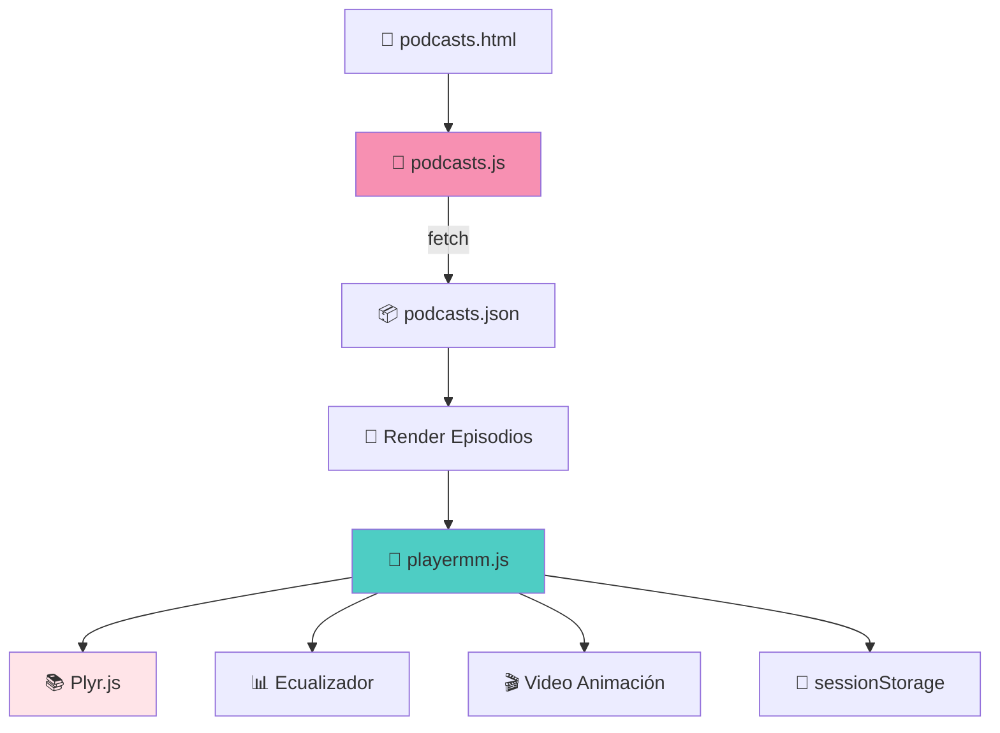

<div align="center">


</div>

# 🎙️ Sistema de Podcasts - Documentación Completa v3.1.0
## 📋 Tabla de Contenidos

1. [Visión General](#-visión-general)
2. [Arquitectura del Sistema](#-arquitectura-del-sistema)
3. [Componentes JavaScript](#-componentes-javascript)
4. [Estilos SCSS](#-estilos-scss)
5. [Estructura de Datos](#-estructura-de-datos)
6. [Animación de Video](#-animación-de-video)
7. [Añadir Nuevos Episodios](#-añadir-nuevos-episodios)
8. [Resolución de Problemas](#-resolución-de-problemas)
---

## 🌟 Visión General

El **Sistema de Podcasts** de JavierTamaritWeb proporciona un reproductor de audio moderno con características avanzadas, construido sobre **Plyr.js**. Incluye animaciones visuales, ecualizador, persistencia de estado y soporte para modo oscuro.

### Características Principales

| Feature | Descripción | Estado |
|:-------:|:------------|:------:|
| 🎵 **Reproductor Plyr.js** | Player de audio cross-browser | ✅ |
| 📊 **Ecualizador Animado** | Visualización de audio activo | ✅ |
| 🎬 **Video Dinámico** | Animación de neurona al reproducir (v3.1.0) | ✅ |
| 💾 **Persistencia** | Guarda posición y volumen en sessionStorage | ✅ |
| ♿ **Accesibilidad** | ARIA labels y screen reader support | ✅ |
| 🌙 **Dark Mode** | Estilos optimizados para modo oscuro | ✅ |
| 📱 **Responsive** | Diseño adaptativo mobile-first | ✅ |

---

## 🏗️ Arquitectura del Sistema

### Flujo de Datos



### Archivos del Sistema

| Archivo | Responsabilidad | Líneas |
|:--------|:----------------|:------:|
| `podcasts.js` | Carga datos JSON, renderiza episodios | ~247 |
| `playermm.js` | Clase PodcastPlayer con Plyr.js | ~500 |
| `podcasts-preview.js` | Preview en página principal | ~100 |
| `_podcast.scss` | Estilos del reproductor | ~1148 |
| `podcasts.json` | Datos de episodios | Variable |

---

## 🔧 Componentes JavaScript

### Clase `PodcastManager`

**Archivo:** `src/js/podcasts.js`

Gestiona la carga y renderizado de episodios desde JSON.

```javascript
class PodcastManager {
    constructor() {
        this.podcasts = [];
        this.categorias = [];
        this.players = [];
        this.init();
    }
}
```

#### Métodos Principales

| Método | Descripción |
|:-------|:------------|
| `init()` | Inicializa carga asíncrona |
| `loadPodcastsData()` | Fetch de `podcasts.json` |
| `renderCategory()` | Renderiza descripción de categoría |
| `renderEpisodes()` | Crea tarjetas de episodios |
| `createEpisodeCard(episode)` | Genera HTML de un episodio |
| `initPlayers()` | Inicializa reproductores Plyr |
| `destroy()` | Limpieza al salir de página |

---

### Clase `PodcastPlayer`

**Archivo:** `src/js/playermm.js`

Wrapper avanzado de Plyr.js con características adicionales.

```javascript
class PodcastPlayer {
    static videoSource = 'video/animaciones/animacion_reproductor_1.mp4';
    static videoBlobUrl = null;
    static isPreloading = false;
    
    constructor(audioElement, episodeId) {
        this.audioElement = audioElement;
        this.episodeId = episodeId;
        // ...
    }
}
```

#### Propiedades Estáticas

| Propiedad | Descripción |
|:----------|:------------|
| `videoSource` | Ruta del video de animación |
| `videoBlobUrl` | Blob URL precargado (performance) |
| `isPreloading` | Flag para evitar cargas duplicadas |

#### Métodos Principales

| Método | Descripción |
|:-------|:------------|
| `init()` | Inicializa Plyr con opciones |
| `preloadVideo()` | Precarga video como Blob (estático) |
| `createEqualizer()` | Crea barras de ecualizador animadas |
| `createVideoElement()` | Inyecta `<video>` en contenedor |
| `resetAllVideos()` | Pausa otros videos activos |
| `setupEventListeners()` | Configura play/pause/ended |
| `saveState()` / `loadState()` | Persistencia en sessionStorage |
| `announceToScreenReader()` | Accesibilidad para screen readers |
| `destroy()` | Limpieza de recursos |

#### Configuración de Plyr

```javascript
const plyrOptions = {
    controls: ['play', 'progress', 'current-time', 'mute', 'volume'],
    keyboard: { focused: true, global: false },
    tooltips: { controls: true, seek: true },
    i18n: {
        restart: 'Reiniciar',
        play: 'Reproducir',
        pause: 'Pausar',
        seek: 'Buscar',
        mute: 'Silenciar',
        unmute: 'Activar sonido',
        volume: 'Volumen'
    }
};
```

---

## 🎨 Estilos SCSS

**Archivo:** `src/scss/ui/componentes/_podcast.scss`

### Estructura de Clases BEM

```
.podcast-main
.podcast-hero
    &__title
    &__description
.podcast-category
    &__title
    &__description
.podcast-episodes
.podcast-episode
    &__image-container
    &__image
    &__badge
    &__content
    &__meta
    &__title
    &__description
.podcast-player-container
.podcast-equalizer
    &__bar
.podcast-episode__video  (Nuevo v3.1.0)
```

### Variables Utilizadas

```scss
$podcast-gradient: linear-gradient(135deg, #f790b2, #4ECDC4);
$border-radius: 10px;
$box-shadow: 0 4px 15px rgba(0, 0, 0, 0.1);
```

### Personalización de Plyr

```scss
.plyr {
    &--audio .plyr__controls {
        background: transparent;
    }
    
    &__control:hover {
        background: $podcast-gradient;
    }
    
    &__progress__buffer,
    &__progress__played {
        // Colores rosa/turquesa personalizados
    }
}
```

---

## 📦 Estructura de Datos

### Formato de `podcasts.json`

```json
{
    "categorias": [
        {
            "id": "gaviotas-anclas",
            "nombre": "Gaviotas y Anclas",
            "descripcion": "Explorando el equilibrio entre libertad y estabilidad..."
        }
    ],
    "episodios": [
        {
            "id": 1,
            "temporada": 1,
            "episodio": 1,
            "titulo": "Título del Episodio",
            "descripcion": "Descripción del episodio...",
            "fecha": "2024-12-01",
            "duracion": "15:30",
            "archivo": "episodio-1.m4a",
            "imagen": "podcast-cover.webp"
        }
    ]
}
```

### Schema.org Markup

Cada episodio incluye datos estructurados para SEO:

```json
{
    "@context": "https://schema.org",
    "@type": "PodcastEpisode",
    "episodeNumber": 1,
    "seasonNumber": 1,
    "name": "Título",
    "description": "Descripción",
    "datePublished": "2024-12-01",
    "duration": "PT15M30S"
}
```

---

## 🎬 Animación de Video (v3.1.0)

### Descripción

Cuando un episodio se reproduce, aparece una animación de **neurona** superpuesta a la imagen del micrófono. El video se precarga para rendimiento óptimo.

### Implementación

#### JavaScript (playermm.js)

```javascript
// Precarga del video (una vez para todas las instancias)
static async preloadVideo() {
    if (PodcastPlayer.videoBlobUrl || PodcastPlayer.isPreloading) return;
    
    PodcastPlayer.isPreloading = true;
    const response = await fetch(PodcastPlayer.videoSource);
    const blob = await response.blob();
    PodcastPlayer.videoBlobUrl = URL.createObjectURL(blob);
}

// Creación del elemento video
createVideoElement() {
    const video = document.createElement('video');
    video.className = 'podcast-episode__video';
    video.src = PodcastPlayer.videoBlobUrl;
    video.muted = true;
    video.loop = true;
    video.playsInline = true;
    this.imageContainer.appendChild(video);
    this.videoElement = video;
}
```

#### SCSS (_podcast.scss)

```scss
.podcast-episode__video {
    position: absolute;
    top: 0;
    left: 0;
    width: 100%;
    height: 100%;
    object-fit: cover;
    z-index: 5;
    opacity: 0;
    transition: opacity 0.5s ease;
    background: $negro;
}

.podcast-episode__image-container.is-playing-video {
    .podcast-episode__video {
        opacity: 1;
    }
}
```

---

## ➕ Añadir Nuevos Episodios

### Paso 1: Añadir archivo de audio

1. Formato recomendado: **M4A** (AAC)
2. Ubicación: `src/podcasts/nombre-episodio.m4a`
3. Bitrate recomendado: 128-192 kbps

### Paso 2: Actualizar podcasts.json

```json
{
    "id": 5,
    "temporada": 1,
    "episodio": 5,
    "titulo": "Mi Nuevo Episodio",
    "descripcion": "Descripción del contenido...",
    "fecha": "2024-12-15",
    "duracion": "20:45",
    "archivo": "mi-nuevo-episodio.m4a",
    "imagen": "microfono.png"
}
```

### Paso 3: Compilar y verificar

```bash
# Compilar assets
npx gulp

# Abrir en navegador
open build/podcasts.html
```

### Checklist de Nuevo Episodio

- [ ] Archivo de audio añadido a `src/podcasts/`
- [ ] ID único asignado en JSON
- [ ] Temporada y número de episodio correctos
- [ ] Fecha en formato YYYY-MM-DD
- [ ] Duración en formato MM:SS
- [ ] Descripción atractiva
- [ ] Probado en reproducción
- [ ] Probado en modo oscuro
- [ ] Verificado responsive (mobile/tablet/desktop)

---

## 🔧 Resolución de Problemas

### El reproductor no aparece

**Causas posibles:**
1. Plyr.js no está cargado
2. `podcasts.json` no se encuentra

**Solución:**
```javascript
// Verificar en consola
console.log(typeof Plyr); // Debe ser 'function'
```

### El video no se reproduce

**Causas posibles:**
1. Video no precargado
2. Archivo no existe

**Solución:**
```javascript
// Verificar precarga
console.log(PodcastPlayer.videoBlobUrl);
```

### El ecualizador no anima

**Causas posibles:**
1. `prefers-reduced-motion: reduce` activo
2. CSS no compilado

**Solución:**
- Verificar preferencias del sistema
- Recompilar: `npx gulp css`

### Audio no carga

**Causas posibles:**
1. Ruta incorrecta en JSON
2. Formato no soportado

**Solución:**
- Verificar que el archivo existe en `build/podcasts/`
- Usar formato M4A o MP3

---

<div align="center">

## 🎧 Recursos Adicionales

[Plyr.js Docs](https://plyr.io/) • [Schema.org PodcastEpisode](https://schema.org/PodcastEpisode) • [WAI-ARIA Media](https://w3c.github.io/aria-practices/examples/slider/slider-2.html)

---

**© 2025 Javier Tamarit**  
*Sistema de Podcasts v3.1.0*

**Última actualización:** 2025-12-13  
**Módulos JavaScript:** 3  
**Líneas SCSS:** 1,148

[📚 Volver](README.md) • [🎨 Dark Mode](dark-mode.md) • [🍳 Recetas](recetas-sistema.md)

</div>
