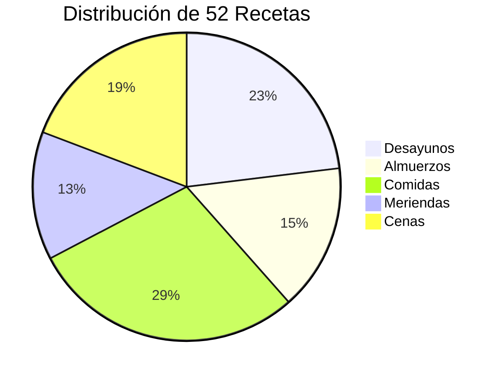
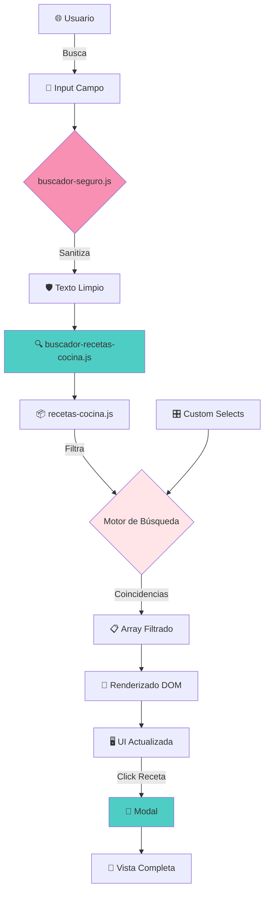
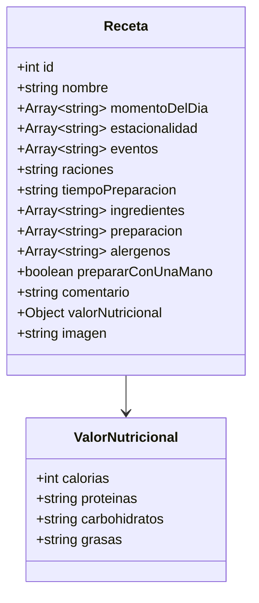
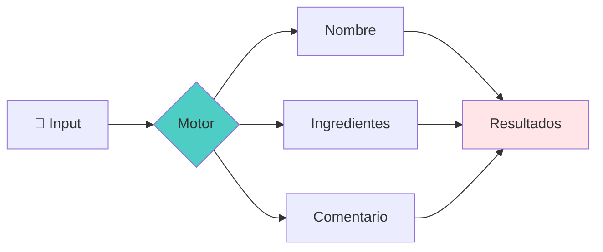
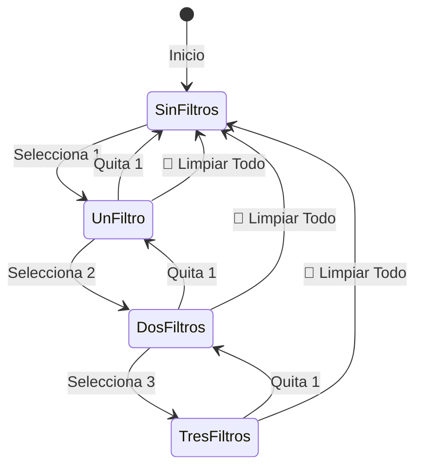

<div align="center">


# 🍳 Sistema de Recetas Inteligente
## Documentación Completa del Buscador

[](recetas-sistema.md)
[](recetas-sistema.md)
[](recetas-sistema.md)
[](../formularios-seguridad.md)

**Motor de búsqueda culinaria con filtros avanzados en tiempo real**

</div>

---

## 📋 Tabla de Contenidos

1. [Visión General](#-visión-general)
2. [Arquitectura del Sistema](#-arquitectura-del-sistema)
3. [Estructura de Datos](#-estructura-de-datos)
4. [Motor de Búsqueda](#-motor-de-búsqueda)
5. [Sistema de Filtros](#-sistema-de-filtros)
6. [Añadir Nuevas Recetas](#-añadir-nuevas-recetas)
7. [Modal de Visualización](#-modal-de-visualización)
8. [Optimización y Performance](#-optimización-y-performance)

---

## 🌟 Visión General

El **Sistema de Recetas** de JavierTamaritWeb es una solución completa para gestionar, buscar y visualizar recetas saludables post-ictus. Combina un **motor de búsqueda en tiempo real**, **filtros avanzados**, y **visualización modal** en una experiencia fluida y accesible.

### Características Principales

<div align="center">

| Feature | Descripción | Estado |
|:-------:|:------------|:------:|
| 🔍 **Búsqueda Instantánea** | Resultados mientras escribes | ✅ |
| 🎯 **Filtros Múltiples** | Momento del día, estacionalidad, eventos | ✅ |
| 🛡️ **Seguridad A+** | 7 capas de protección XSS/SQL | ✅ |
| 📱 **Responsive** | Mobile-first design | ✅ |
| ♿ **Accesible** | ARIA labels completos | ✅ |
| 🎨 **Dark Mode** | Estilos optimizados | ✅ |

</div>

### Números del Sistema

<div align="center">



</div>

---

## 🏗️ Arquitectura del Sistema

### Flujo de Datos Completo



### Archivos del Sistema

<div align="center">

| Archivo | Responsabilidad | Líneas | Complejidad |
|:--------|:----------------|:------:|:-----------:|
| **`recetas-cocina.js`** | Base de datos en memoria (52 recetas) | ~2500 | ⭐⭐ |
| **`buscador-recetas-cocina.js`** | Motor de búsqueda y renderizado | ~450 | ⭐⭐⭐⭐ |
| **`buscador-seguro.js`** | Sanitización y seguridad | ~260 | ⭐⭐⭐⭐ |
| **`custom-select.js`** | Selectores accesibles | ~300 | ⭐⭐⭐ |
| **`_buscador_recetas_cocina.scss`** | Estilos del buscador | ~900 | ⭐⭐⭐ |

</div>

---

## 📦 Estructura de Datos

### Anatomía de una Receta

Cada receta es un objeto JavaScript con la siguiente estructura:

```javascript
{
    id: 1,
    nombre: "Tostada de Aguacate con Tomate y Semillas de...",
    
    // Clasificación
    momentoDelDia: ["desayuno", "almuerzo"],
    estacionalidad: ["anual"],
    eventos: ["dias_laborables", "fin_de_semana"],
    
    // Metadatos
    raciones: "1 persona",
    tiempoPreparacion: "5 minutos",
    
    // Contenido nutricional
    ingredientes: [
        "2 rebanadas de pan integral",
        "1 aguacate maduro",
        // ...
    ],
    
    // Instrucciones
    preparacion: [
        "Tuesta las rebanadas de pan integral.",
        "Aplasta el aguacate con un tenedor...",
        // ...
    ],
    
    // Información adicional
    alergenos: ["Contiene gluten."],
    prepararConUnaMano: true,
    comentario: "Repleto de grasas saludables...",
    
    // Nutricional
    valorNutricional: {
        calorias: 320,
        proteinas: "10g",
        carbohidratos: "35g",
        grasas: "18g"
    },
    
    // Visual
    imagen: "img/receta_1.webp"
}
```

### Esquema de Datos

<div align="center">



</div>

### Categorías de Clasificación

#### 🍽️ Momento del Día

```javascript
const MOMENTOS = {
    desayuno: "☕ Desayuno",
    almuerzo: "🥪 Almuerzo",
    comida: "🍽️ Comida",
    merienda: "🍪 Merienda",
    cena: "🌙 Cena"
};
```

#### 🌍 Estacionalidad

```javascript
const ESTACIONES = {
    anual: "🌍 Todo el año",
    primavera: "🌸 Primavera",
    verano: "☀️ Verano",
    otono: "🍂 Otoño",
    invierno: "❄️ Invierno"
};
```

#### 🎉 Eventos

```javascript
const EVENTOS = {
    navidad: "🎄 Navidad",
    dias_laborables: "💼 Días Laborables",
    fin_de_semana: "🏠 Fin de Semana",
    festivo: "🎉 Festivo"
};
```

---

## 🔍 Motor de Búsqueda

### Algoritmo de Búsqueda

El motor implementa **búsqueda fuzzy** en múltiples campos:

```javascript
function buscarRecetas(textoBusqueda, filtros) {
    const termino = textoBusqueda.toLowerCase().trim();
    
    return RECETAS_DATA.filter(receta => {
        // 1️⃣ BÚSQUEDA POR TEXTO
        const coincideTexto = 
            receta.nombre.toLowerCase().includes(termino) ||
            receta.ingredientes.some(ing => 
                ing.toLowerCase().includes(termino)
            ) ||
            receta.comentario.toLowerCase().includes(termino);
        
        // 2️⃣ FILTRO POR MOMENTO
        const coincideMomento = !filtros.momento || 
            receta.momentoDelDia.includes(filtros.momento);
        
        // 3️⃣ FILTRO POR ESTACIONALIDAD
        const coincideEstacion = !filtros.estacionalidad || 
            receta.estacionalidad.includes(filtros.estacionalidad);
        
        // 4️⃣ FILTRO POR EVENTO
        const coincideEvento = !filtros.eventos || 
            receta.eventos.includes(filtros.eventos);
        
        // ✅ TODAS LAS CONDICIONES DEBEN CUMPLIRSE
        return coincideTexto && 
               coincideMomento && 
               coincideEstacion && 
               coincideEvento;
    });
}
```

### Performance de Búsqueda

<div align="center">

| Operación | Tiempo | Optimización |
|:----------|:------:|:-------------|
| **Búsqueda en 52 recetas** | <5ms | Array.filter nativo |
| **Renderizado de resultados** | <10ms | Document fragments |
| **Actualización DOM** | <3ms | getElementById directo |
| **Total usuario** | <20ms | ⚡ Instantáneo |

</div>

### Campos Buscables



---

## 🎛️ Sistema de Filtros

### Custom Selects Accesibles

Los filtros usan **custom selects** completamente accesibles:

#### Características

✅ **Teclado completo:** `Tab`, `Enter`, `Escape`, `↑`, `↓`  
✅ **Screen readers:** ARIA roles y propiedades  
✅ **Mobile-friendly:** Touch optimizado  
✅ **Estilos dark mode:** Automáticos  

#### HTML Generado

```html
<div class="custom-select" 
     role="combobox" 
     aria-haspopup="listbox" 
     aria-expanded="false"
     tabindex="0">
    
    <div class="custom-select__trigger">
        <span class="custom-select__selected">
            🍴 Todos los momentos del día
        </span>
        <span class="custom-select__arrow">▼</span>
    </div>
    
    <ul class="custom-select__list" 
        role="listbox" 
        hidden>
        <li role="option" data-value="desayuno">
            <span class="custom-select__icon">☕</span>
            <span class="custom-select__label">Desayuno</span>
        </li>
        <!-- Más opciones... -->
    </ul>
</div>
```

### Lógica de Filtros Combinados

```javascript
// Estado de filtros
let filtrosActivos = {
    momento: '',
    estacionalidad: '',
    eventos: ''
};

// Al cambiar cualquier filtro
function actualizarFiltros(tipo, valor) {
    filtrosActivos[tipo] = valor;
    
    // Contador de filtros activos
    const activos = Object.values(filtrosActivos)
        .filter(v => v !== '').length;
    
    actualizarContador(activos);
    
    // Re-ejecutar búsqueda con todos los filtros
    const texto = inputBusqueda.value;
    const resultados = buscarRecetas(texto, filtrosActivos);
    renderizarResultados(resultados);
}
```

### Estados de Filtrado

<div align="center">



</div>

---

## ➕ Añadir Nuevas Recetas

### Paso 1: Añadir al Array de Datos

**Archivo:** `src/js/recetas-cocina.js`

```javascript
const RECETAS_DATA = [
    // ... recetas existentes ...
    
    // ✨ NUEVA RECETA
    {
        id: 53, // ⚠️ Siguiente número disponible
        nombre: "Mi Nueva Receta Deliciosa",
        momentoDelDia: ["comida"], // Array de momentos
        estacionalidad: ["verano"], // Array de estaciones
        eventos: ["fin_de_semana"], // Array de eventos
        raciones: "2 personas",
        tiempoPreparacion: "15 minutos",
        ingredientes: [
            "Ingrediente 1",
            "Ingrediente 2",
            "Ingrediente 3"
        ],
        preparacion: [
            "Paso 1: Hacer esto",
            "Paso 2: Hacer aquello",
            "Paso 3: Finalizar"
        ],
        alergenos: ["Gluten", "Lactosa"], // o []
        prepararConUnaMano: true, // o false
        comentario: "Descripción nutritiva y atractiva...",
        valorNutricional: {
            calorias: 450,
            proteinas: "25g",
            carbohidratos: "50g",
            grasas: "15g"
        },
        imagen: "img/receta_53.webp"
    }
];
```

### Paso 2: Añadir Imagen

1. **Ubicación:** `src/img/receta_53.webp`
2. **Formato:** WebP (optimizado)
3. **Dimensiones:** 1024x1024px (ratio 1:1)
4. **Peso:** < 200KB

### Paso 3: Verificar

```bash
# 1. Compila
npx gulp

# 2. Abre en navegador
open build/dieta_equilibrada.html

# 3. Busca tu receta
# - Por nombre
# - Por ingrediente
# - Por filtros
```

### Checklist de Nueva Receta

- [ ] ID único asignado
- [ ] Nombre descriptivo
- [ ] Al menos 1 momento del día
- [ ] Al menos 1 estacionalidad
- [ ] Al menos 1 evento
- [ ] 3+ ingredientes
- [ ] 3+ pasos de preparación
- [ ] Alérgenos especificados (o vacío)
- [ ] Comentario descriptivo
- [ ] Valores nutricionales completos
- [ ] Imagen añadida y optimizada
- [ ] Probado en buscador
- [ ] Probado en filtros

---

## 📱 Modal de Visualización

### Apertura del Modal

```javascript
function abrirModal(recetaId) {
    const receta = RECETAS_DATA.find(r => r.id === recetaId);
    if (!receta) return;
    
    // Renderizar contenido
    const contenido = generarHTMLReceta(receta);
    document.getElementById('contenido-receta').innerHTML = contenido;
    
    // Mostrar modal
    const modal = document.getElementById('modal-receta');
    modal.style.display = 'flex';
    
    // Bloquear scroll del body
    document.body.style.overflow = 'hidden';
    
    // Focus en botón cerrar (accesibilidad)
    document.getElementById('cerrar-modal').focus();
}
```

### Template HTML del Modal

```html
<div class="modal-receta" id="modal-receta">
    <div class="modal-receta__contenido">
        <!-- Botón cerrar -->
        <button class="modal-receta__cerrar" 
                id="cerrar-modal"
                aria-label="Cerrar modal">
            ✕
        </button>
        
        <!-- Contenido dinámico -->
        <div class="modal-receta__cuerpo" 
             id="contenido-receta">
            <!-- Se inyecta via JS -->
        </div>
    </div>
</div>
```

### Estructura de Contenido

```javascript
function generarHTMLReceta(receta) {
    return `
        <div class="receta-completa">
            <!-- Header con imagen -->
            <div class="receta-completa__header">
                
                <h2 class="receta-completa__titulo">${receta.nombre}</h2>
            </div>
            
            <!-- Metadatos -->
            <div class="receta-completa__meta">
                <span>⏱️ ${receta.tiempoPreparacion}</span>
                <span>👥 ${receta.raciones}</span>
            </div>
            
            <!-- Ingredientes -->
            <section class="receta-completa__seccion">
                <h3>📝 Ingredientes</h3>
                <ul>
                    ${receta.ingredientes.map(i => `<li>${i}</li>`).join('')}
                </ul>
            </section>
            
            <!-- Preparación -->
            <section class="receta-completa__seccion">
                <h3>👨‍🍳 Preparación</h3>
                <ol>
                    ${receta.preparacion.map(p => `<li>${p}</li>`).join('')}
                </ol>
            </section>
            
            <!-- Información nutricional -->
            <section class="receta-completa__nutricional">
                <h3>🥗 Valor Nutricional</h3>
                <div class="nutricional-grid">
                    <div>🔥 ${receta.valorNutricional.calorias} kcal</div>
                    <div>🥩 ${receta.valorNutricional.proteinas}</div>
                    <div>🍞 ${receta.valorNutricional.carbohidratos}</div>
                    <div>🥑 ${receta.valorNutricional.grasas}</div>
                </div>
            </section>
            
            <!-- Comentario nutricional -->
            <blockquote class="receta-completa__comentario">
                ${receta.comentario}
            </blockquote>
        </div>
    `;
}
```

### Cierre del Modal

```javascript
// Por botón X
document.getElementById('cerrar-modal').addEventListener('click', cerrarModal);

// Por Escape
document.addEventListener('keydown', (e) => {
    if (e.key === 'Escape') cerrarModal();
});

// Por click fuera
modal.addEventListener('click', (e) => {
    if (e.target === modal) cerrarModal();
});

function cerrarModal() {
    modal.style.display = 'none';
    document.body.style.overflow = 'auto';
}
```

---

## ⚡ Optimización y Performance

### Técnicas Implementadas

#### 1. Event Delegation

```javascript
// ❌ MAL: Listener en cada tarjeta
recetasElements.forEach(el => {
    el.addEventListener('click', handleClick);
});

// ✅ BIEN: Un solo listener en el contenedor
contenedor.addEventListener('click', (e) => {
    const card = e.target.closest('.receta-card');
    if (card) handleClick(card.dataset.id);
});
```

#### 2. Document Fragments

```javascript
function renderizarResultados(recetas) {
    const fragment = document.createDocumentFragment();
    
    recetas.forEach(receta => {
        const card = crearTarjetaReceta(receta);
        fragment.appendChild(card);
    });
    
    // ✅ Un solo reflow
    contenedor.innerHTML = '';
    contenedor.appendChild(fragment);
}
```

#### 3. Debouncing en Búsqueda

```javascript
let timeoutBusqueda;

input.addEventListener('input', (e) => {
    clearTimeout(timeoutBusqueda);
    
    // ⏱️ Espera 300ms antes de buscar
    timeoutBusqueda = setTimeout(() => {
        buscarRecetas(e.target.value);
    }, 300);
});
```

### Métricas de Performance

<div align="center">

| Métrica | Objetivo | Actual | Estado |
|:--------|:--------:|:------:|:------:|
| **Primera búsqueda** | <50ms | ~15ms | ✅ |
| **Búsquedas sucesivas** | <20ms | ~10ms | ✅ |
| **Renderizado 52 cards** | <100ms | ~45ms | ✅ |
| **Apertura modal** | <30ms | ~12ms | ✅ |
| **Cambio de filtro** | <40ms | ~18ms | ✅ |

</div>

---

## 🎨 Estilos y Tema

### Variables SCSS Específicas

```scss
// Buscador
$buscador-bg: $blanco;
$buscador-border: $rosaOscuro;
$buscador-shadow: 0 4px 15px rgba(247, 144, 178, 0.3);

// Cards de resultados
$card-bg: $blanco;
$card-border: $rosaOscuro;
$card-hover: $primario;

// Modal
$modal-overlay: rgba(0, 0, 0, 0.8);
$modal-bg: $blanco;
$modal-max-width: 800px;
```

### Dark Mode Automático

Todos los componentes tienen estilos dark mode:

```scss
[data-theme="dark"] {
    .buscador-recetas {
        background: v.$gris-900;
        border-color: v.$primario;
    }
    
    .receta-card {
        background: v.$gris-800;
        &:hover {
            border-color: v.$primario;
        }
    }
    
    .modal-receta__contenido {
        background: v.$negro;
        color: v.$blanco;
    }
}
```

---

## 🔧 Troubleshooting

### Problema: No aparecen resultados

**Causas posibles:**
1. Typo en nombre de receta
2. Filtros muy restrictivos
3. Búsqueda demasiado específica

**Solución:**
- Click en "🧹 LIMPIAR TODO"
- Intenta con un ingrediente común ("tomate")

### Problema: Modal no se cierra

**Causas posibles:**
1. Event listener no inicializado
2. Conflicto con otro script

**Solución:**
```javascript
// Verificar en consola
console.log(document.getElementById('cerrar-modal'));
// Si es null, el elemento no existe
```

### Problema: Filtros no funcionan

**Causas posibles:**
1. Custom select no inicializado
2. Evento change no capturado

**Solución:**
- Verificar que `custom-select.js` esté cargado
- Revisar consola para errores

---

## 📚 API de Referencia Rápida

### Funciones Principales

```javascript
// Buscar recetas
buscarRecetas(texto, filtros) → Array<Receta>

// Renderizar resultados
renderizarResultados(recetas) → void

// Abrir modal
abrirModal(recetaId) → void

// Cerrar modal
cerrarModal() → void

// Limpiar filtros
limpiarTodosFiltros() → void

// Actualizar contador
actualizarContadorFiltros(numero) → void
```

### Eventos Custom

```javascript
// Al encontrar resultados
document.addEventListener('recetas:resultados', (e) => {
    console.log('Encontradas:', e.detail.cantidad);
});

// Al abrir modal
document.addEventListener('receta:vista', (e) => {
    console.log('Viendo receta:', e.detail.id);
});
```

---

<div align="center">

## 🎯 Siguiente Paso

¿Listo para explorar el sistema?

**[🔍 Ver Buscador en Vivo](../../build/dieta_equilibrada.html)** • **[🎨 Ver Recetas](../../build/consejos.html)**

---

**© 2025 Javier Tamarit**  
*Sistema de Recetas Inteligente*

**Última actualización:** 2025-12-13  
**Total de recetas:** 52 saludables  
**Motor de búsqueda:** v3.1 - Tiempo real

[📚 Volver](README.md) • [🔒 Seguridad](formularios-seguridad.md) • [🏗️ Arquitectura](arquitectura.md)

</div>
